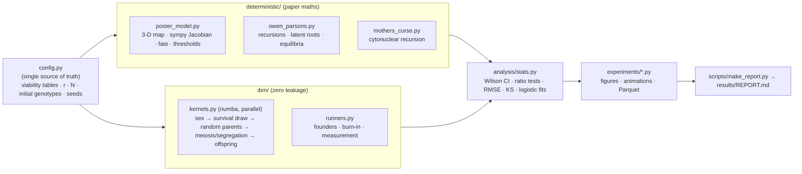

# Computational models: sexual conflict in *Drosophila* (EBL lab, IISER Mohali)

Simulation, emulation and statistical tests of published sexual-conflict results from the Evolutionary Biology
Lab (N.G. Prasad), IISER Mohali.

| Where | What |
|---|---|
| [`reports/manual/manual.pdf`](reports/manual/manual.pdf) | **Start here.** Report and build manual (LaTeX sources alongside): summary, worked examples, theory, build steps, results, audit, hypothesis tests, troubleshooting |
| [`sexconflict/`](sexconflict/), `scripts/`, `tests/`, `results/` | Project 1: poster two-locus model, Parsons/Owen, mother's curse. Deterministic oracle vs zero-leakage IBM (this README, below) |
| [`manas_sa/`](manas_sa/) | Project 2: hybrid analytic / IBM / emulator model of Manas Geeta Arun's sexual-antagonism results, plus the optional Chinmay (2019) mate-choice, harm and telegony modules ([`manas_sa/README.md`](manas_sa/README.md)) |
| [`manas_sa/docs/07_leakage_audit.md`](manas_sa/docs/07_leakage_audit.md), [`08_hypothesis_tests.md`](manas_sa/docs/08_hypothesis_tests.md) | Leakage and circularity audit; formal tests of whether the model predicts each result |
| [`SOURCES.md`](SOURCES.md) | **Credits and licences** for every paper, dataset and tool used. Only openly licensed papers are redistributed |

Quick start: `python -m venv .venv`, then `pip install -r requirements.txt`, then `python -m pytest -q tests manas_sa/tests`.

Several source PDFs named in the tables below (the poster, Parsons, Havird, Morrow) are copyrighted and **not
included**. See [`SOURCES.md`](SOURCES.md) for links.

---

## Project 1. Antagonistic alleles: deterministic models vs. individual-based emulation

This project rebuilds the models behind the documents in this folder. For each one it asks whether a population of
simulated organisms, built only from biological primitives, produces the patterns the mathematics predicts.

| Source in folder | What it contains | What we built |
|---|---|---|
| `Poster_Manas.pdf`: Samant, Moitra, Sinha & Prasad (IISER Mohali), *A two-locus haploid model for the resolution of intra-locus sexual conflict* | 3-D iterative map, linear stability, bifurcation and basin analyses | **Full reconstruction** of every panel, plus an IBM counterpart for each |
| `Parsons(1961).pdf` (same file as `P.A. Parsons.pdf`): *Initial progress of new genes with viability differences between sexes and with sex linkage* | Latent-root invasion conditions (2.5), (2.6), (3.6), (4.1) | Oracle + IBM for the autosomal and X-linked cases; Owen's (1953) two stable equilibria |
| `PIIS0960982219303185.pdf`: Havird et al. 2019, *Selfish mitonuclear conflict* (review) | Verbal theory: "mother's curse", the twofold rule, restorers | Formalised as a cytonuclear model, with an IBM |
| `Morrow et al (2002) Behavioural Ecology.pdf` | Insect harm experiments (ANOVA) | No model to simulate; used as biological context only |
| `Simulating Population Genetics Models.txt` | An earlier prompt plus an AI blueprint for Owen/Mandel (1971) | Design principles adopted (zero leakage, smoke tests, KS/RMSE, phase portraits); its Mandel cubic is **verified** numerically |

Results: [`results/REPORT.md`](results/REPORT.md) (auto-generated), figures in `results/figures/`, GIFs in
`results/animations/`, data in `results/data/` (Parquet / npz), run metadata in `results/summary.json`.

---

## 1. Design: two engines that share only conditions



**The zero-leakage contract** is enforced by `tests/test_smoke.py::test_ibm_never_imports_the_paper_maths`.
- The IBM never imports `deterministic/`, `sympy` or `scipy`.
- It never evaluates a recursion, an equilibrium (not even p*: its populations reach their own IaSC state in a
  burn-in), an eigenvalue, or an expected frequency.
- It receives only a **viability table**, a **crossover probability**, an **inheritance mode**, **N**, and the
  **initial genotypes of individuals**.
- Each generation is built from events on individuals:
  1. Every individual is assigned a sex by a fair coin.
  2. Each individual survives with probability equal to its viability ÷ the largest viability in its sex.
  3. Each of N offspring picks a uniformly random surviving mother and father.
  4. Gametes form by Mendelian segregation, with a crossover between loci with probability r.
  5. Mitochondria come from the mother; males pass on a Y, not an X.
- Frequencies are only *counted* for the record.

## 2. Mathematics

### 2.1 Poster model (two-locus, haploid selection, dioecious, random mating)

Haplotypes x = (x11, x12, x21, x22) = (A1M1, A1M2, A2M1, A2M2). Their fitnesses:

| | A1M1 | A1M2 | A2M1 | A2M2 |
|---|---|---|---|---|
| males | 1+a | 1+a | 1 | 1 |
| females | 1+b·k1 | 1 | 1+b·k2 | 1+b |

**Life cycle (reconstructed).** The poster does not state it. The cycle below is the one that reproduces the
poster's p* formula exactly:

1. Haploid offspring have the same haplotype frequencies in both sexes.
2. Selection acts in each sex: m_ij = x_ij·w^m_ij / w̄_m and f_ij = x_ij·w^f_ij / w̄_f.
3. A female and a male haplotype unite at random, then meiosis recombines them with probability r:

  x'_ij = ½(1−r)(f_ij + m_ij) + ½ r (f_{A_i}·m_{M_j} + m_{A_i}·f_{M_j})

Here f_{A_i} and m_{M_j} are the allele marginals after selection.

**One-locus IaSC.**
- Recursion: p' = ½[p(1+a)/(1+ap) + p/(1+b(1−p))].
- Fixed points satisfy p·[2ab p² − (a−b+3ab)p + (a−b+ab)] = 0, whose roots are p = 0, p = 1 and
  **p\* = (ab+a−b)/(2ab) = ½ + ½(1/b − 1/a)**, exactly as on the poster.
- p\* is interior iff **−1 < 1/b − 1/a < 1**, i.e. a ∈ (b/(1+b), b/(1−b)). For b = 0.2 that is a ∈ (1/6, 1/4),
  the poster's a-axis.
- The restoring eigenvalue dp'/dp at p\* lies in [0.992, 0.99997] for b = 0.2. The polymorphism is stable, but
  only weakly, especially near the edges. Section 4 shows why this matters.

**Invasion of the modifier.** The face x11 = x21 = 0 is invariant, so at the IaSC point (0, p\*, 0) the
Jacobian is block-triangular:

  J = [[B, 0], [·, μ]]   in the ordering (x11, x21 | x12)

Its eigenvalues are therefore μ (the one-locus restoring eigenvalue) and those of the 2×2 matrix B.
**M1 invades ⇔ ρ(B) > 1.**

The Jacobian is derived symbolically with sympy (no hand algebra) and checked against finite differences.
We also give a hand-derived closed form, tested to agree with sympy to 1e-12. It uses
W_m = 1+ap\*, W_f = 1+b(1−p\*), φ_m = p\*(1+a)/W_m, φ_f = p\*/W_f, and
α = (1+a)/W_m, γ = 1/W_m, β_1 = (1+bk1)/W_f, β_2 = (1+bk2)/W_f:

```
B11 = ½(1−r)(β1+α) + ½r(φf·α + φm·β1)        B12 = ½r(φf·γ + φm·β2)
B21 = ½r((1−φf)α + (1−φm)β1)                 B22 = ½(1−r)(β2+γ) + ½r((1−φf)γ + (1−φm)β2)
```

What this explains:
- **r → 0:** the eigenvalues become 1 + bk1/(2W_f) and 1 − b(1−k2)/(2W_f). Any k1 > 0 invades on the A1
  background. This is the thin unstable strip along r ≈ 0 in the poster's (a, r) panels.
- **Recombination** mixes M1 onto A2, where it costs b(1−k2). So **lower r favours resolution** (poster
  result 4). A larger a raises p\*, putting more M1 on A1 (poster result 3).

**Global questions** are answered by vectorised iteration of the map (`fate`):
- the bifurcation diagrams;
- the minimum M1 dose, found by bisection;
- the basins, from Dirichlet(1,1,1,1) initial conditions.

### 2.2 Parsons (1961) / Owen (1953)

**Autosomal.** Females have viabilities (a1, h1, b1) for AA, Aa, aa; males have (a2, h2, b2).
- Recursion: p_i' = [a_i p1p2 + ½h_i(p1q2+p2q1)] / [a_i p1p2 + h_i(p1q2+p2q1) + b_i q1q2].
  The ½ is lost in the OCR of the scan.
- Linearised at p = 0: the dominant latent root is **λ = ½(h1/b1 + h2/b2)**. So A invades iff
  **h1b2 + h2b1 > 2b1b2** (eq. 2.5), which is ≈ β1 + β2 > 0 for small effects (eq. 2.6).

**X-linked.**
- Males: p2' = a2p1/(a2p1+b2q1).
- The characteristic equation λ² − (h1/2b1)λ − h1a2/(2b1b2) = 0 gives the exact invasion condition
  **h1(a2+b2) > 2b1b2**, which is ≈ 2β1 + β2 − α2 > 0 (eq. 3.6).
- The scan shows the "note added in proof" as h1(a2+b2) > b1b2. A factor of 2 is needed for consistency
  with (3.6), so we read its absence as a scan artefact.

**Equilibria** are found numerically: solve the female equation for u2(u1), then root-bracket the male residual,
with u = p/q. The cubic attributed to Mandel (1971) in the AI blueprint gives the same equilibria in all
4,000 random parameter sets tested.

### 2.3 Mother's curse (Havird et al. 2019), formalised

The state is the zygote distribution Z[c, g], where c is the mito type (maternal) and g ∈ {0, 1, 2} is the
number of copies of a nuclear restorer R.

- Females: (1+s_f·c)(1−cost·d(g)).
- Males: (1 − s_m·c·(1 − restore·d(g)))(1−cost·d(g)), with dominance d = (0, h, 1).

Derived predictions:
- **Strong form.** The rare-mito growth factor is 1+s_f, independent of s_m.
- **Twofold rule.** For a nuclear allele with the same effects, Parsons' root gives λ = ½(w_f,het + w_m,het).
  With sterile males (w_m = 0), invasion needs w_f > 2. This is the review's "at least twofold" statement, and
  it is a special case of Parsons' eq. 2.5.
- **Weak form.** With s_f = 0 the variant is neutral, so P(fix) = initial frequency for every s_m.

### 2.4 Extended suite: classical sexual-antagonism theory and drift theory (`deterministic/sa_classics.py`)

| ID | Proven result tested | Oracle | IBM |
|---|---|---|---|
| E1 | Kidwell et al. 1977 / Fry 2010 eq. 3: autosomal protected polymorphism | latent roots at both boundaries ≡ Fry eq. 3 (checked in 20k random sets) | two rare-invasion experiments per (s_f, s_m) cell |
| E2 | Rice 1984 eq. 2 vs Fry 2010: X-linked vs autosomal | X-linked latent roots ≡ Rice eq. 2 | X-linked kernel |
| E3 | Kimura 1962 fixation probability | sex-averaged Kimura; **full diffusion u(p) = ∫ψ/∫ψ** with drift M(p) from the complete recursion; haploid formula with Ne = N/2 for mito | thousands of populations (GPU) |
| E4 | Rice 1987: SA locus linked to the sex-determining region | new two-locus recursion (A1 on X in eggs, X-sperm, Y-sperm; crossover r) | new kernel with **genetic sex determination** (sex = inherited Y) |
| E5 | Backward Kolmogorov mean absorption time | finite-difference solver, ½V T″ + M T′ = −1 | time until the IaSC polymorphism is lost |

**Fitness scheme** (Kidwell/Rice/Fry). A1 is male-beneficial.

| | A1A1 | A1A2 | A2A2 |
|---|---|---|---|
| males | 1 | 1 − h_m·s_m | 1 − s_m |
| females | 1 − s_f | 1 − h_f·s_f | 1 |

X-linked males: A1 → 1, A2 → 1 − s_m.

**ML, analysis layer only; nothing feeds back into the IBM**

- **M1. GP denoiser.** Heteroscedastic Gaussian-process regression on tanh(½·log invasion ratio), fitted to IBM
  outcomes only. The length scale is bounded below by the grid spacing, and the sampling variance is floored. The
  emergent region is compared with the oracle by IoU.
- **M2. Neural emulator** (MLP), trained on IBM fixation data for N ≤ 600 and tested on N = 800.
  - Generic inputs (log N, s) fail to extrapolate.
  - The diffusion scaling variable N·s extrapolates. The IBM data therefore exhibit Kimura's Ns data collapse.
- **M3. Inverse problem.** Recover (s_f, s_m) from one IBM trajectory, either with an amortised MLP trained on IBM
  simulations or by a least-squares fit of the oracle recursion.
- **Tuner (E5).** The IBM's effective size, measured from its own one-step fluctuations, is fed into the diffusion
  theory.

## 3. Algorithms (per experiment)

| ID | Oracle | IBM | Comparison |
|---|---|---|---|
| P0 | p\* formula + iterated recursion | burn-in from 50 % A1, time-averaged frequency | RMSE vs N |
| P1 | ρ(B) on a 101×101 (a, r) grid for each (k1, k2) → fraction stable | – | vs poster heatmaps |
| P2 | stable/unstable map; trajectory from (p\*, m0 = 2 %, D = 0) | burn-in → mutate 2 % of individuals to M1 → 300 generations | sign of mean change (95 % CI) vs oracle; IBM-vs-oracle ratio scatter |
| P2c | restoring eigenvalue μ(a) | fraction of populations still polymorphic after T | drift erosion vs μ |
| P3 | `fate` from near / away initial conditions | ensemble means | overlay |
| P4 | bisection for the minimum M1 dose | P(resolution) vs dose, three N | logistic midpoint vs threshold |
| P5 | Dirichlet initial conditions → basin fraction | the same initial conditions as founders | per-initial-condition agreement |
| P6 | trajectory | ensembles over N | RMSE, between-population SD ∝ N^−½ |
| P7 | trajectories | animated populations | fate agreement |
| O1/O3 | latent root; trajectory from the founding dose | 20 founding copies | ratio test + establishment map |
| O2 | Parsons' worked example | 64 populations | equilibrium match |
| O4 | flow field (streamplot), equilibria, basins | grid of starts + animation | basin agreement |
| C1–C4 | cytonuclear recursion | IBM with maternal mito | endpoint KS, threshold, P(fix), arms race |

## 4. How to run

```bash
python -m venv .venv
.venv/Scripts/python -m pip install -r requirements.txt
.venv/Scripts/python -m pytest -q tests
.venv/Scripts/python scripts/run_all.py --profile full
.venv/Scripts/python scripts/make_report.py
```

- On Linux/macOS, use `.venv/bin/python`.
- `--profile quick` runs everything in a few minutes for smoke testing; `--only poster,owen,curse` selects suites.
- `--steps P4,P5,O` reruns only the steps whose id starts with one of those prefixes; earlier results in
  `summary.json` are kept.
- **Machine sharing.** Runs default to `cpu_count − 2` numba threads at below-normal priority, so other work on
  the machine stays responsive. Override with the `SC_THREADS` environment variable.

### GPU backend (optional, AMD/any OpenCL GPU)

```bash
.venv/Scripts/python -m pip install -r requirements-gpu.txt
.venv/Scripts/python scripts/run_all.py --profile full --backend opencl
.venv/Scripts/python -m pytest -q tests/test_gpu.py
```

**What's available on this machine**
- ROCm/HIP, CuPy, JAX-GPU and CUDA are not available: AMD's Windows ROCm does not support the Radeon RX 560X
  (Polaris).
- **OpenCL works** with both GPUs: the RX 560X ("Baffin", 16 compute units, 4 GB) and the Vega 8 iGPU.

**How the GPU kernels work** (`sexconflict/ibm/opencl_backend.py`)
- They implement the same biological primitives as the CPU kernels.
- One work-item per individual draws its sex and survival; one work-item per offspring draws its parents.
- Parents are drawn by rejection sampling among survivors, which is exactly uniform over the survivors.
- Random numbers come from a counter-based hash, so runs are reproducible.
- Results are statistically equivalent to the CPU kernels, not bit-identical. `tests/test_gpu.py` checks this
  with 400 replicate populations per comparison.
- Select the device with `SC_GPU_DEVICE=Baffin` (default: the GPU with the most compute units).
- The X-linked kernel stays on the CPU.

**Measured throughput (individual-generations per second)**

| | Throughput |
|---|---|
| CPU (numba, 8 threads) | ≈3.8×10⁷ |
| RX 560X, large ensembles | 2.7–3.8×10⁸ (**7–10×**) |
| RX 560X, small ensembles | ≈6×10⁷ (limited by kernel-launch overhead) |

**Deterministic speed-up.** `poster_model.fate_fast` is a numba-compiled, per-element-stopping version of the map
iteration, about 8× faster than numpy. A regression test checks it against a fully converged numpy reference.
- Seeds are derived from `MASTER_SEED` and each experiment's name (`config.seed_for`), so any single experiment
  reproduces bit-for-bit on its own. Numba's per-thread RNG is reseeded per replicate.
- Library choices:
  - **numba** (parallel `prange`, about 4×10⁷ individual-generations/s on 8 cores) for the IBM;
  - **sympy** for exact Jacobians (JAX is not available for this Windows/Python 3.14 combination);
  - **numpy** broadcasting for vectorised maps;
  - **scipy** for root-finding and statistics;
  - **pandas/pyarrow** for Parquet;
  - **matplotlib** for static figures, streamplots and GIF animations (Pillow writer).
