# Report: do individual-based populations reproduce the papers' mathematics?

_Auto-generated by `scripts/make_report.py` from `results/summary.json`. Profile `full`, master seed `20261005`, Python 3.14.6, numpy 2.5.3, numba 0.68.0, run 2026-10-05 17:27:01._

Lines in figures are the deterministic oracle (the papers' equations). Dots, bands and animated points are the zero-leakage individual-based model (IBM), which only knows viabilities, recombination, inheritance rules, N and the founding genotypes.

## 1. Poster: two-locus haploid model of IaSC resolution (Samant et al.)

### 1.1 The IaSC polymorphism (panel A)

* p* = ½ + ½(1/b − 1/a) is confirmed by iterating the recursion (max deviation 0.0 — machine precision).
* IBM time-averaged A1 frequency vs p*: RMSE N=500: 0.125, N=5000: 0.016; max |error| at the largest N = 0.033.

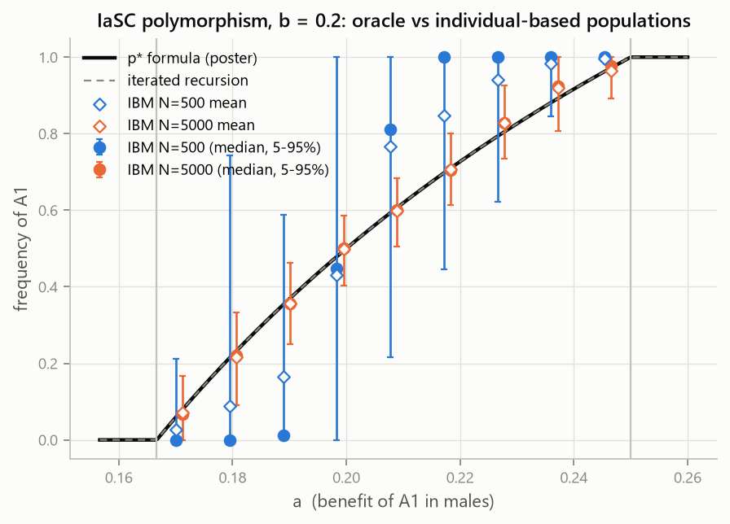

**Finite-population caveat (new).** The restoring eigenvalue at p* is only 0.9917–0.99997, so balancing selection is very weak, especially near the edges of the a-range. In the IBM, drift fixes one allele within hundreds to thousands of generations unless N is large. The deterministic model cannot show this: there, the conflict persists forever.

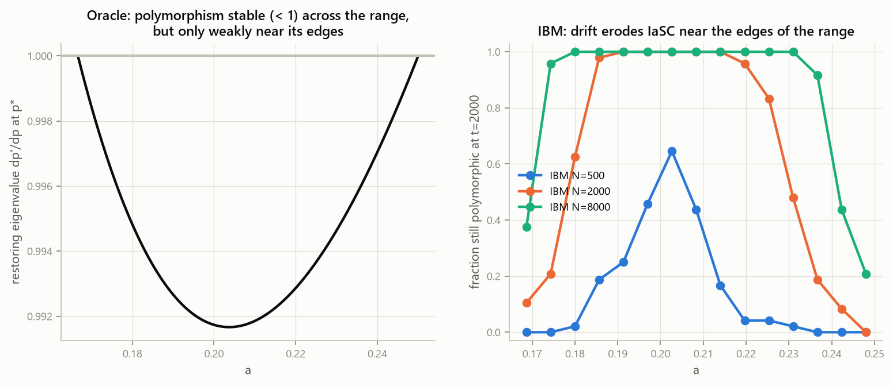

### 1.2 Linear stability of the IaSC fixed point (poster heatmaps and (a, r) panels)

| modifier (k1, k2) | fraction stable, b = 0.2 | fraction stable, b = 0.02 |
|---|---|---|
| (0.2, 0.2) | 0.612 | 0.781 |
| (0.8, 0.8) | 0.089 | 0.178 |
| (0.5, 0.5) | 0.288 | 0.467 |
| (0.2, 0.8) | 0.340 | 0.479 |
| (0.8, 0.2) | 0.248 | 0.456 |
| (0.5, 1.0) | 0.000 | 0.000 |
| (0.0, 0.5) | 1.000 | 1.000 |

Stable means the IaSC persists, because a rare M1 cannot invade. The (a, r) rectangle spans the whole polymorphism range a ∈ (b/(1+b), b/(1−b)) and r ∈ (0, 0.5]. All five poster summary points are reproduced:

1. k2 < 1 does not guarantee resolution; the stable fraction is large unless k1 is large.
2. Weaker selection (b = 0.02) gives a larger stable fraction, i.e. less resolution.
3. Larger a favours invasion.
4. Smaller r favours invasion. Analytically, at r → 0 the invasion eigenvalue is 1 + b·k1/(2W_f) > 1 for any k1 > 0.
5. In the small-effect corner (k1 ≤ 0.1, k2 ≥ 0.9) the outcome is very sensitive to k1 and k2.

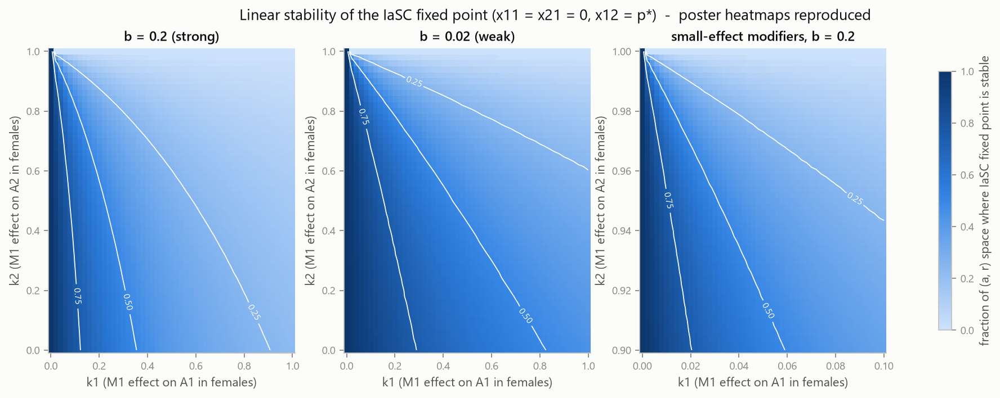

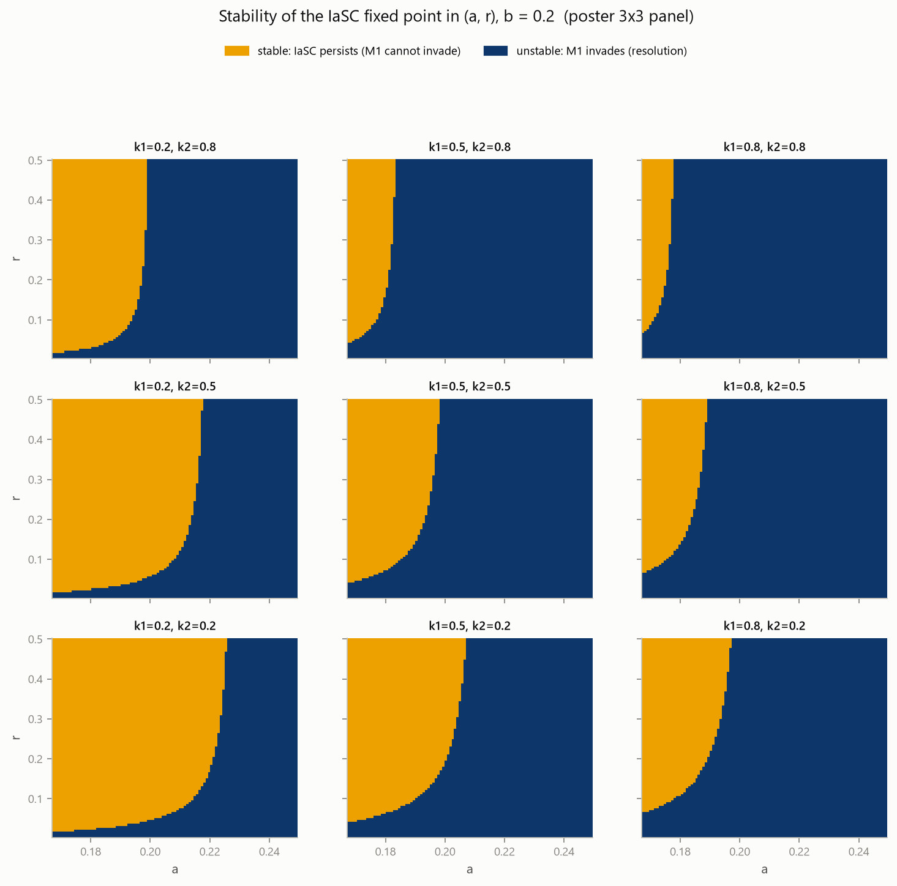

**IBM test.** In 105 parameter cells, IBM populations first reached their own IaSC state, and then 2% of individuals mutated to M1. Verdicts on the ensemble-mean change over 300 generations (95% CI): {'IBM: spreads': 71, 'IBM: declines': 27, 'IBM: unresolved': 7}.

* Among decided cells, the direction agrees with the oracle trajectory from the same dose in **99%** of cases, and with the linear-stability sign (λ > 1) in 95%.
* log(IBM spread) vs log(oracle spread): r = 0.935.
* 1 cell disagrees. λ = 0.9978; all are within about 0.5% of neutrality, where drift dominates.

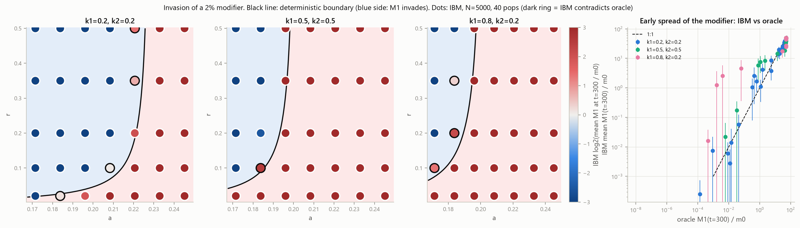

### 1.3 Bifurcation diagrams (r = 0.1, b = 0.2)

Oracle invasion thresholds (the a at which M1 first fixes, starting near the fixed point), next to values read off the poster:

| modifier | reconstruction | poster (read from plot) |
|---|---|---|
| k1=0.2, k2=0.2 | 0.2142 | ≈0.212 |
| k1=0.8, k2=0.8 | 0.1710 | ≈0.169 |
| k1=0.5, k2=0.5 | 0.1855 | ≈0.184 |
| k1=0.2, k2=0.8 | 0.1940 | ≈0.193 |
| k1=0.8, k2=0.2 | 0.1780 | ≈0.176 |
| k1=0.5, k2=1 | 0.1668 | ≈0.166 |
| k1=0, k2=0.5 | never | never |

IBM dots are ensemble means. Where M1 invades, a 2% dose still fails in some populations (lost to drift while rare), so mean M1 sits between 0 and 1. That mean is the empirical probability of resolution.

The **'away' panel** of the poster does not state its initial condition. Here pA1 = 0.5, pM1 = 0.75, D = 0. This reproduces the black curve's shape (a jump to A1 fixation, with M1 left at an intermediate value because it is neutral on an A1 background when k1 = 0). It does not reproduce the orange curve's M1 = 0.75 plateau for a < 1/6, which no generic initial condition gives. See *Open questions*.

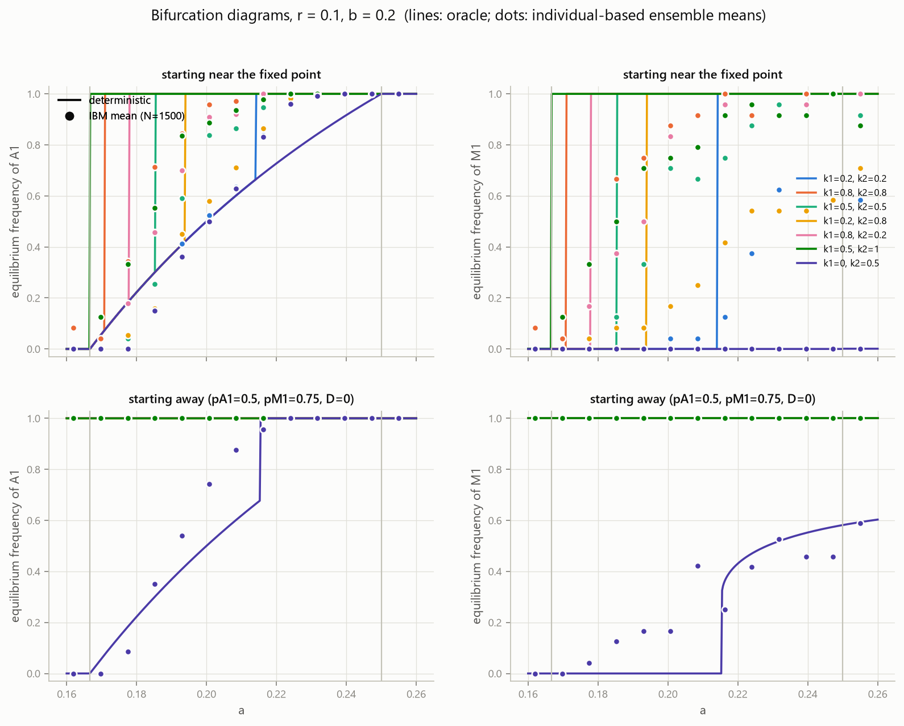

### 1.4 Size of perturbation needed, and basins

| case | oracle threshold | IBM logistic midpoint | IBM transition width |
|---|---|---|---|
| a=0.19, N=500 | 0.415 | 0.569 | 0.160 |
| a=0.19, N=2000 | 0.415 | 0.425 | 0.085 |
| a=0.19, N=6000 | 0.415 | 0.387 | 0.044 |
| a=0.205, N=500 | 0.109 | 0.211 | 0.104 |
| a=0.205, N=2000 | 0.109 | 0.132 | 0.056 |
| a=0.205, N=6000 | 0.109 | 0.116 | 0.035 |

The oracle threshold is a separatrix (bistability). In the IBM it becomes a sigmoid whose midpoint approaches the oracle threshold as N grows and whose width shrinks.

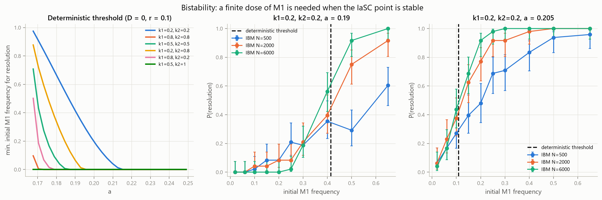

Per-initial-condition agreement between IBM endpoints and oracle endpoints (same founders): {'0.0, 0.5': 0.6830357142857143, '0.2, 0.2': 0.8794642857142857}.

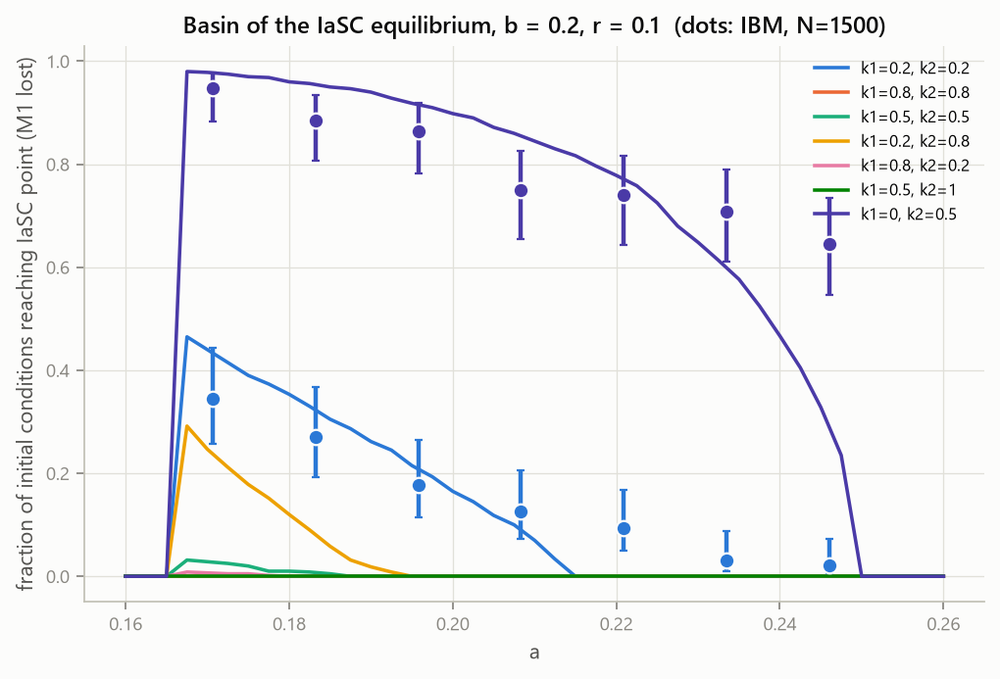

### 1.5 Convergence and animation

Between-population SD scales as N^-0.61 for N ≥ 1000 (95% CI -0.81 to -0.40), consistent with the diffusion expectation of −0.5. Over all N, including N ≤ 500, the slope is -0.76 (-0.92 to -0.61). It is steeper because small populations sometimes lose M1 outright, which adds a second source of variance. The ensemble mean converges onto the oracle trajectory.

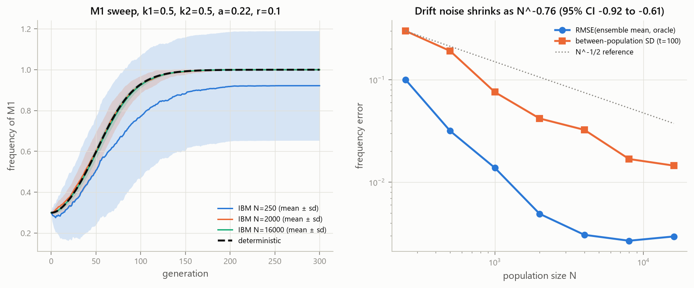

Animated bistability (`animations/poster_bistability.gif`): 84% of individual populations end in the basin the oracle predicts from their starting point.

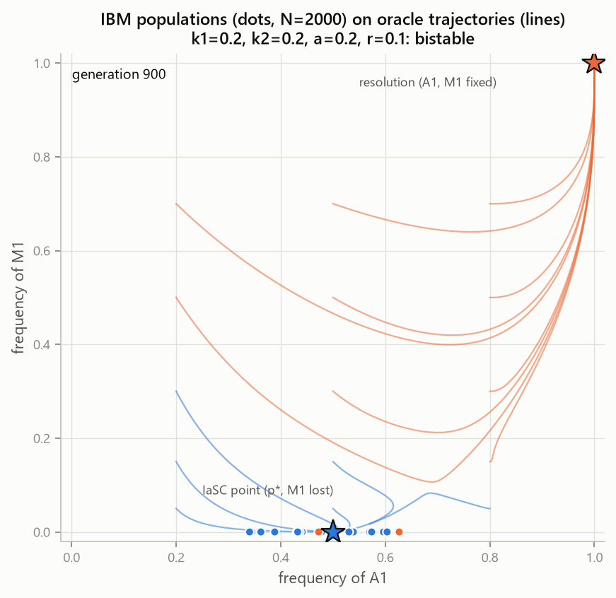

## 2. Parsons (1961) / Owen (1953)

* **Autosomal (eq. 2.5)** h1b2 + h2b1 > 2b1b2: IBM verdicts {'IBM: declines': 37, 'IBM: spreads': 36, 'IBM: unresolved': 8}; agreement among decided cells **100%**; corr(λ, P(establish)) = 0.893.
* **Parsons' worked example** (β1 = 0.05, β2 = −0.02): λ = 1.0165 > 1, so the gene increases. The oracle equilibrium is p1 = 0.4399 and the IBM median is 0.4402. 92% of IBM populations increased.
* **X-linked (eq. 3.6)**: IBM verdicts {'IBM: declines': 40, 'IBM: spreads': 39, 'IBM: unresolved': 2}; agreement among decided **100%**. The approximate (3.6) and exact conditions disagree in 0 cells.
* **Owen bistability**: 3 interior equilibria; stable flags [True, False, True]. The cubic quoted in the earlier AI blueprint gives the same points. IBM basin agreement **100%**. Misses lie next to the saddle, where drift decides.

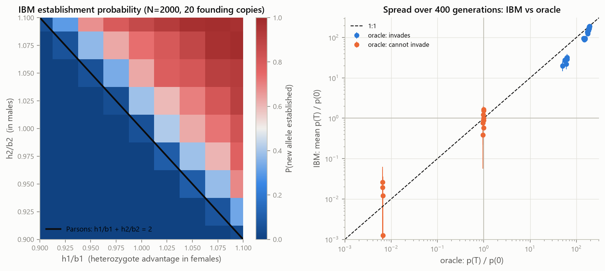

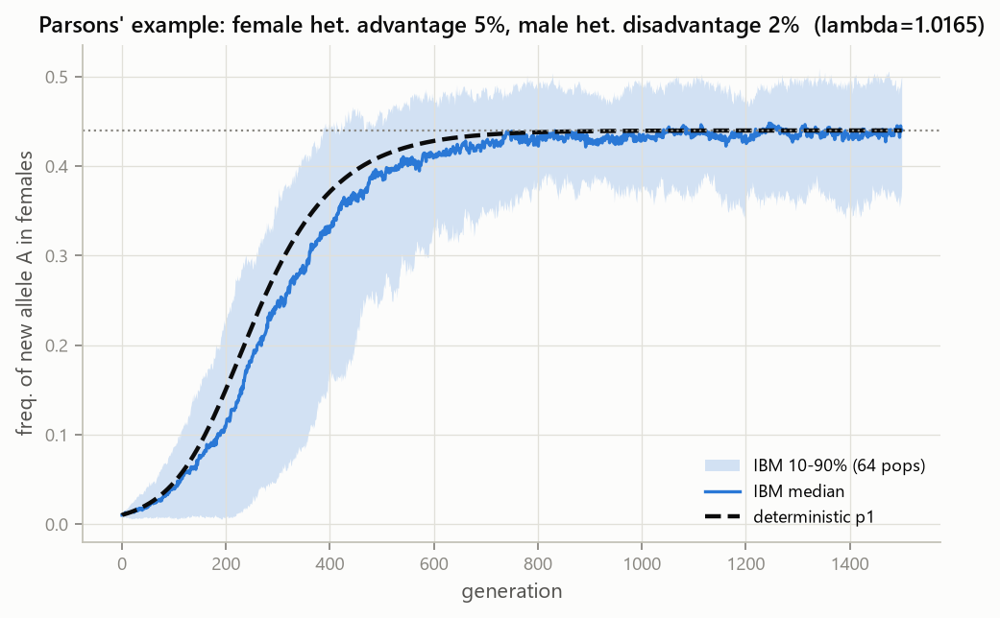

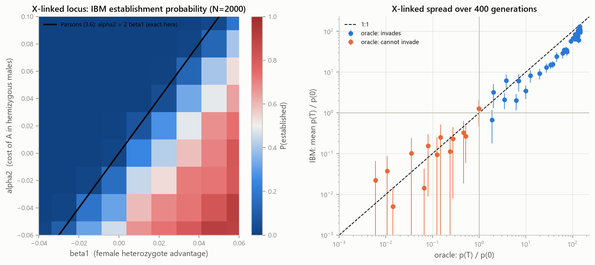

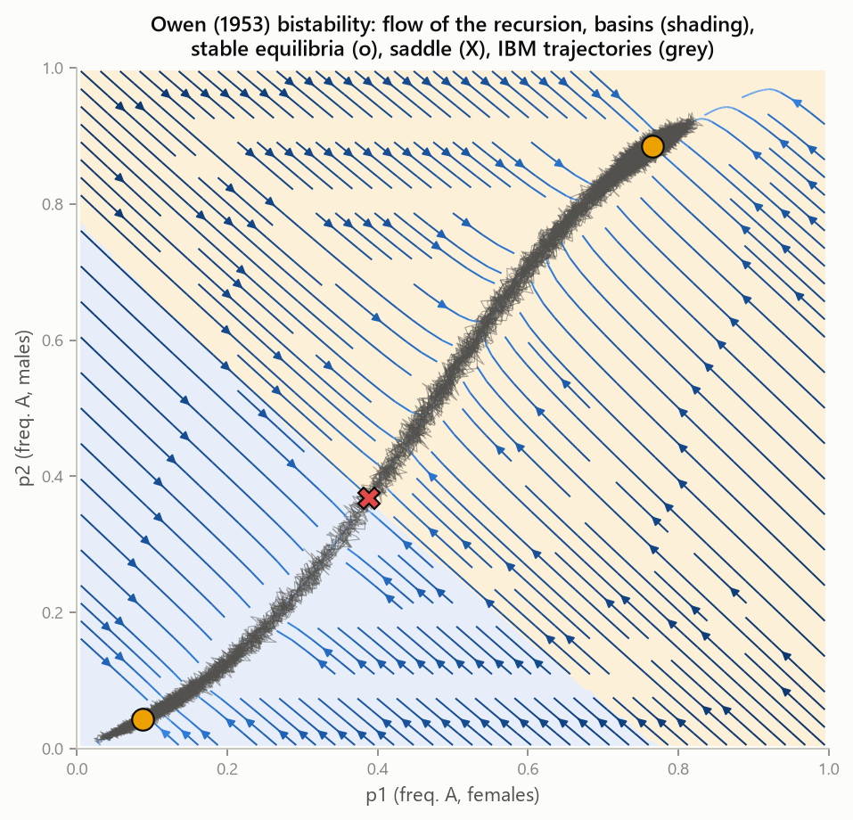

## 3. Mother's curse (Havird et al. 2019), formalised

* **Strong form.** The spread of a female-beneficial mito variant does not depend on how much it harms males. KS tests of IBM endpoint distributions against s_m = 0: s_m=0 vs 0.3: D=0.08, p=0.90; s_m=0 vs 0.6: D=0.11, p=0.56; s_m=0 vs 0.9: D=0.09, p=0.80.
* **Twofold rule.** IBM direction verdicts {'IBM: spreads': 11, 'IBM: declines': 7}; agreement with the oracle **94%**. A male-sterilising mito variant spreads with any female benefit; the nuclear version needs female fitness > 2. This is Parsons' latent root with h2 = 0. The exception is the nuclear (dominant) variant at female fitness 2.10 (λ = 1.05): the oracle invades only to a low equilibrium (ratio 1.14), while the IBM mean ratio is 0.29. Close to the threshold, the invading allele settles at a low frequency that drift often erases. 
* **Weak form** (female-neutral). s_m=0.0: P(fix) = 0.090 [0.072, 0.112]; s_m=0.5: P(fix) = 0.107 [0.088, 0.131]; s_m=1.0: P(fix) = 0.100 [0.081, 0.123]. The neutral expectation is the initial frequency.
* **Restorer, simultaneous**: oracle final restorer frequency 1.000; IBM P(restorer lost) = 0.062, P(fixed) = 0.938.
* **Restorer, sequential**: oracle final restorer frequency 1.000; IBM P(restorer lost) = 0.000, P(fixed) = 1.000.
* **Restorer, control (no mito variant)**: oracle final restorer frequency 0.000; IBM P(restorer lost) = 0.990, P(fixed) = 0.000.

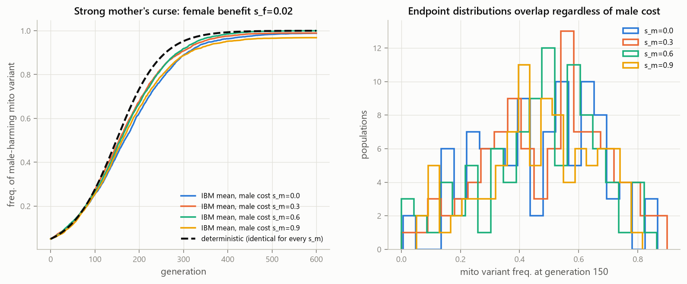

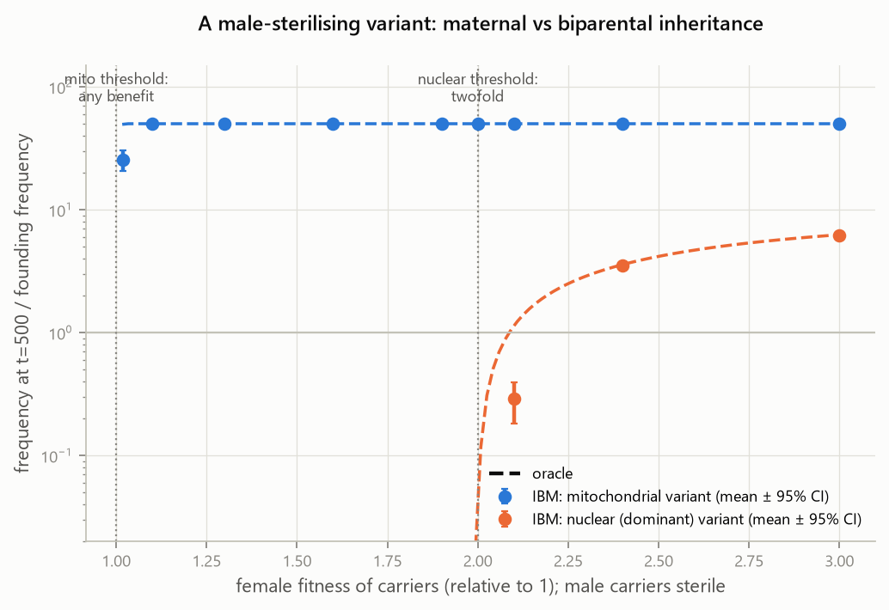

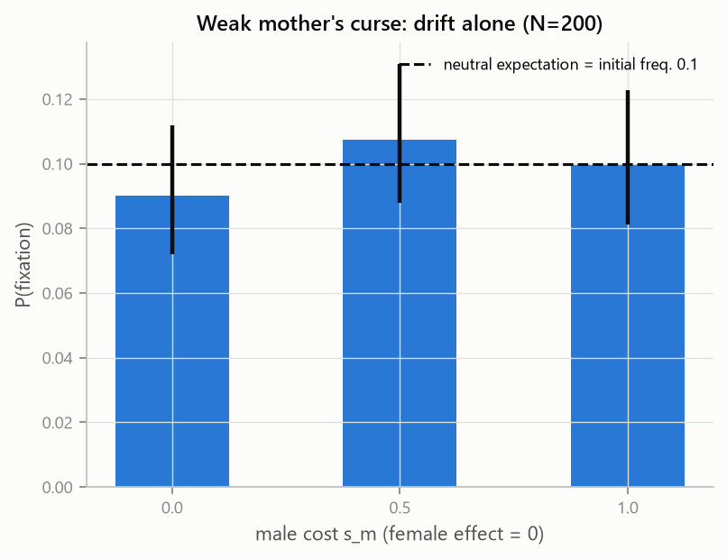

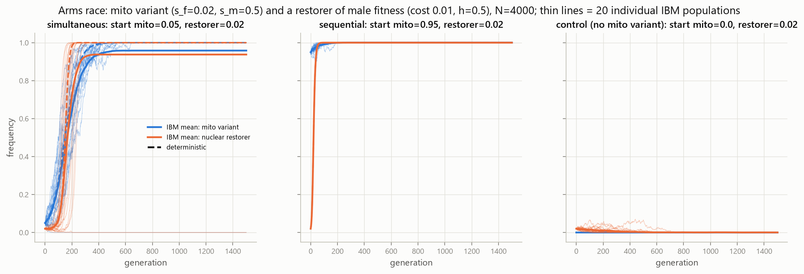

## 4. Extended tests: classical sexual-antagonism theory, drift theory and ML analyses

_IBM backend for this suite: `opencl_backend` (Baffin); the X-linked and X/Y kernels always run on the CPU._

### 4.1 Where can antagonistic polymorphism persist? (Kidwell 1977; Rice 1984; Fry 2010)

Protected polymorphism means both alleles increase when rare. The oracle uses Fry's eq. 3 (autosomes) and Rice's eq. 2 (X). Both were verified to equal Parsons' latent root at each boundary in 20,000 random parameter sets. The IBM runs two invasion experiments per cell. **M1** is a Gaussian-process denoiser fitted only to IBM outcomes; it recovers the emergent boundary, which is compared with the oracle region by intersection-over-union (IoU).

| genome / dominance | oracle area | GP-IBM area | IoU (GP) | IoU (raw grid) | decided cells agreeing |
|---|---|---|---|---|---|
| autosomal | additive | 0.19 | 0.17 | 0.90 | 0.68 | 100% (134/144) |
| X-linked | additive | 0.10 | 0.08 | 0.79 | 0.43 | 100% (60/64) |
| autosomal | dominance reversal h=0.25 | 0.77 | 0.74 | 0.95 | 0.89 | 100% (130/144) |
| X-linked | dominance reversal h=0.25 | 0.49 | 0.46 | 0.91 | 0.72 | 98% (56/64) |
| autosomal | male-benefit recessive (h_f=0.2, h_m=0.8) | 0.19 | 0.18 | 0.89 | 0.52 | 100% (126/144) |
| X-linked | male-benefit recessive (h_f=0.2, h_m=0.8) | 0.57 | 0.52 | 0.92 | 0.81 | 98% (58/64) |

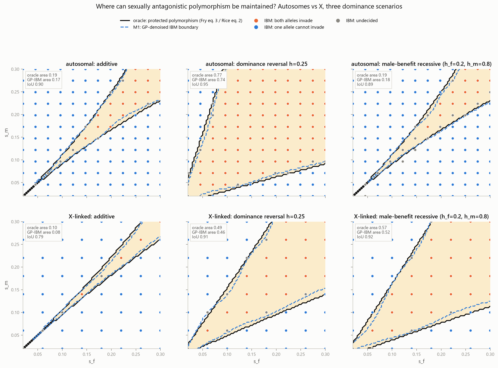

### 4.2 Fixation probabilities (Kimura 1962) and their correction

| selection | RMSE vs Kimura (sex-averaged s) | within 2 SE | RMSE vs full diffusion | within 2 SE | RMSE vs deterministic |
|---|---|---|---|---|---|
| concordant | 0.010 | 100% | 0.010 | 100% | 0.629 |
| maternal mito (male cost 0.5) | 0.005 | 100% | 0.005 | 100% | 0.675 |
| sexually antagonistic | 0.083 | 0% | 0.013 | 86% | 0.697 |

**Reading.**

* Under concordant selection the IBM follows Kimura. A female-beneficial mito variant follows the haploid formula with Ne = N/2, so it drifts twice as strongly; this is the quantitative basis of the drift effects in §3.
* Kimura's sex-averaged formula fails for strongly antagonistic selection (s_f − s_m = 0.1). Expanding the recursion gives Δp ≈ pq[s̄ − p(s_f² + s_m²)]. The second-order term vanishes for a rare allele, so invasion still depends on s̄ alone. It opposes the allele more and more as it becomes common, so fixation is less likely than Kimura predicts, and the shortfall grows with N. This is the same term that creates Kidwell's wedge (protection roughly when 0 < s̄ < s_f² + s_m²).
* The general diffusion formula, built from the full sex-specific recursion, restores agreement. This is the analytic correction the IBM asked for.

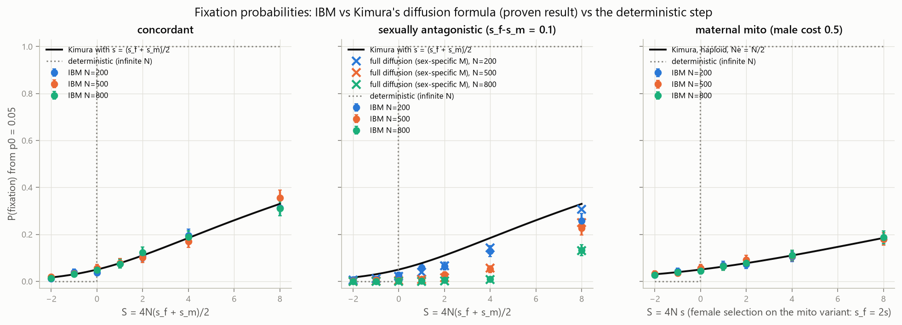

### 4.3 M2: can a neural network trained only on IBM data rediscover Kimura?

* **generic inputs (log N, s)**: RMSE vs IBM on held-out N = 800: 0.048; vs Kimura: 0.046.
* **diffusion-scaled input (N*s)**: RMSE vs IBM on held-out N = 800: 0.026; vs Kimura: 0.010.
* For reference, IBM vs Kimura on the same held-out points: 0.021.

Given the diffusion scaling variable N·s, the emulator extrapolates to an unseen population size about as well as Kimura does. With generic inputs it cannot. So the IBM data support the Ns data-collapse that diffusion theory predicts.

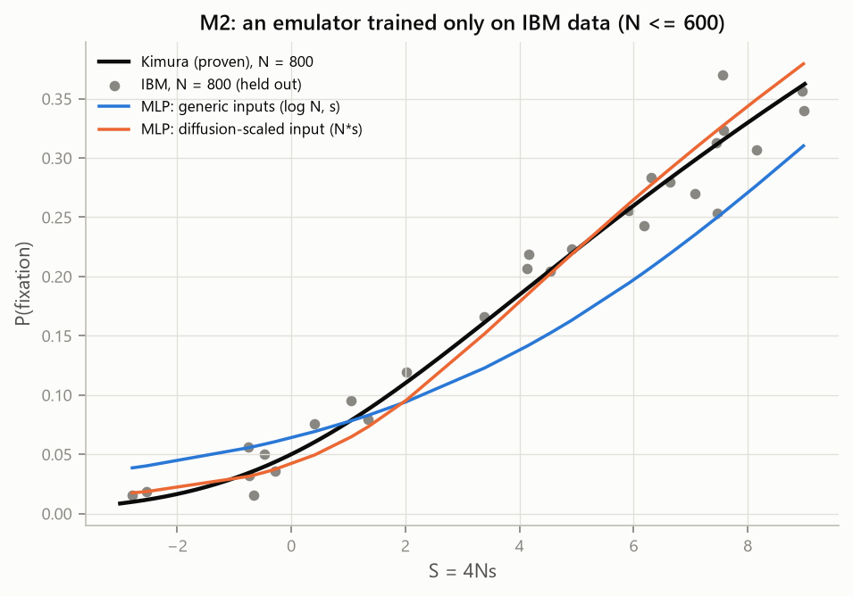

### 4.4 Linkage to the sex-determining region (Rice 1987)

* IBM-vs-oracle agreement on whether the polymorphism is maintained: **96%**.
* Oracle fraction of s_m values with polymorphism, by r: {'0.0': 0.75, '0.01': 0.625, '0.05': 0.5, '0.1': 0.25, '0.2': 0.25, '0.5': 0.125}.
* IBM fraction: {'0.0': 0.75, '0.01': 0.6953125, '0.05': 0.421875, '0.1': 0.265625, '0.2': 0.21875, '0.5': 0.15625}.
* RMSE of the Y−X allele-frequency difference: 0.021.

Tighter linkage widens the conditions for polymorphism and moves the male-benefit allele onto the Y, as Rice predicted. In this IBM, sex is determined genetically, not by a coin flip.

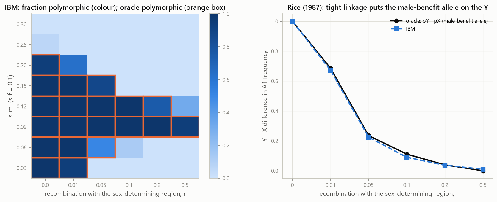

### 4.5 How long does the IaSC polymorphism of the poster survive drift?

* Backward Kolmogorov equation with Ne = N vs IBM mean persistence time: median |relative error| 11%, max 27%.
* **Tuner:** Ne measured from the IBM's own fluctuations (Ne/N mean 0.90) cuts this to median 4%, max 8%.
* The remaining gap is at the smallest N, where the continuous diffusion approximation is weakest.
* Persistence time grows roughly exponentially with N in the middle of the a-range. This makes the finite-population caveat of §1 quantitative.

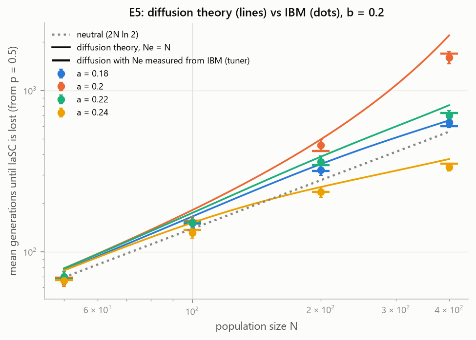

### 4.6 M3: inverse problem — recovering s_f and s_m from one IBM trajectory

| case | RMSE s_f | RMSE s_m | RMSE (s_f − s_m) | bias s_f | bias s_m |
|---|---|---|---|---|---|
| N=500 | MLP (amortised, trained on IBM) | 0.037 | 0.034 | 0.035 | -0.003 | -0.005 |
| N=500 | oracle least-squares fit | 0.099 | 0.100 | 0.034 | 0.024 | 0.024 |
| N=5000 | MLP (amortised, trained on IBM) | 0.012 | 0.014 | 0.013 | 0.001 | 0.001 |
| N=5000 | oracle least-squares fit | 0.030 | 0.031 | 0.010 | 0.003 | 0.002 |

The trajectory pins down the *difference* s_f − s_m far better than either coefficient on its own; the oracle fit is best for the difference. That is an identifiability limit of additive SA selection. In small populations the oracle fit degrades because drift is unmodelled noise. The IBM-trained network is more robust there, so simulation-based inference is the safer choice for real (finite) data.

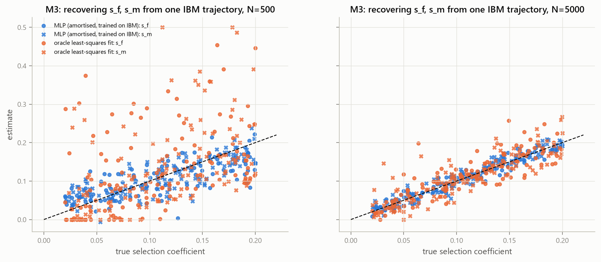

## 5. Open questions for the authors

1. **Life cycle.** We assumed haploid selection in each sex, then random union, then meiosis with recombination, and then sex assigned at random. This reproduces the poster's p* and invasion thresholds. Is it the intended cycle?
2. **'Fraction of parameter space'.** We read this as the fraction of the (a, r) rectangle (b/(1+b), b/(1−b)) × (0, 0.5]. Is that the domain and resolution used?
3. **'Away from the fixed point'.** Which initial condition was used, and how many generations were iterated? The orange plateau at M1 = 0.75 for a < 1/6 is not an attractor of the reconstructed map.
4. **Size-of-perturbation panel.** Which r was used? We assumed r = 0.1.
